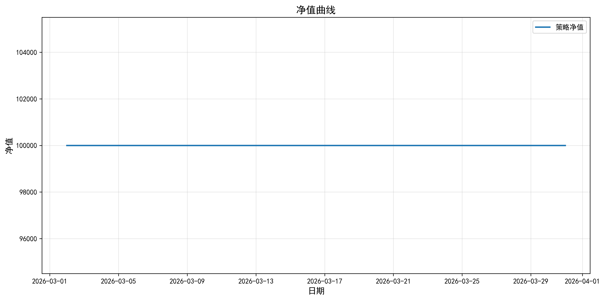
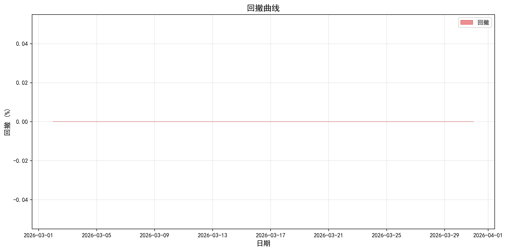
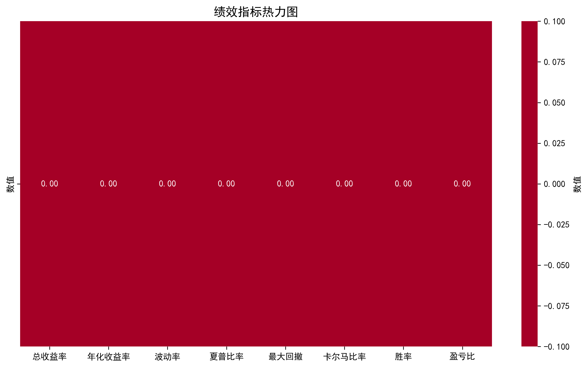
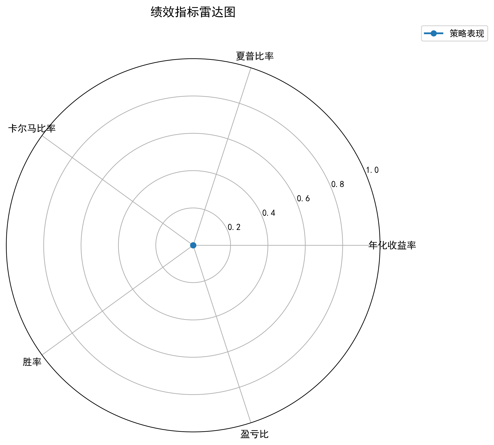

# 六维选股(Python) - 回测报告

**生成时间**: 2026-03-31 20:19:57


---

## 1. 策略概述

- **策略名称**: 六维选股(Python)

- **策略类型**: 六维选股策略

- **策略说明**: 整合主力操盘、庄家控盘、动能二号、共振追涨、强势起爆五个策略的筛选逻辑。


## 2. 回测设置

- **初始资金**: 100,000.00 元

- **手续费率**: 0.1000%

- **滑点率**: 0.1000%

- **无风险利率**: 2.50%

- **回测开始日期**: 2026-03-01

- **回测结束日期**: 2026-03-31

- **股票池数量**: 100

- **初始资金**: 100,000.00 元


## 3. 数据来源

- **行情数据**: AkShare / Tushare / Baostock

- **数据周期**: 日线数据


## 4. 交易规则

- **调仓频率**: 日度调仓

- **交易成本**: 包含手续费和滑点

- **下单方式**: 市价单


## 5. 绩效指标


### 5.1 收益指标

- **总收益率**: 0.00%

- **年化收益率**: 0.00%


### 5.2 风险指标

- **年化波动率**: 0.00%

- **最大回撤**: 0.00%

  - 回撤开始: 2026-03-02

  - 回撤结束: 2026-03-02


### 5.3 风险调整收益指标

- **夏普比率**: 0.0000

- **卡尔马比率**: 0.0000

- **索提诺比率**: 0.0000

- **信息比率**: 4.6583


### 5.4 阿尔法与贝塔

- **贝塔 (Beta)**: 0.0000

- **阿尔法 (Alpha)**: -2.5000%


### 5.5 交易指标

- **总交易次数**: 0

- **胜率**: 0.00%

- **盈亏比**: 0.0000


### 5.6 最终结果

- **初始资金**: 100,000.00 元

- **最终权益**: 100,000.00 元


## 6. 指标计算方法


### 6.1 年化收益率

```
年化收益率 = (1 + 总收益率) ^ (1 / 年数) - 1
```


### 6.2 夏普比率

```
夏普比率 = (年化收益率 - 无风险利率) / 年化波动率
```


### 6.3 最大回撤

```
最大回撤 = max( (历史最高值 - 当前值) / 历史最高值 )
```


### 6.4 卡尔马比率

```
卡尔马比率 = 年化收益率 / 最大回撤
```


### 6.5 胜率

```
胜率 = 盈利交易次数 / 总交易次数
```


### 6.6 盈亏比

```
盈亏比 = 平均盈利 / 平均亏损
```


### 6.7 贝塔 (Beta)

```
Beta = Cov(投资组合收益率, 基准收益率) / Var(基准收益率)
```

- Beta = 1：投资组合的风险与基准相同

- Beta > 1：投资组合的风险高于基准（激进型）

- Beta < 1：投资组合的风险低于基准（保守型）


### 6.8 阿尔法 (Alpha)

```
Alpha = 投资组合年化收益率 - [无风险利率 + Beta * (基准年化收益率 - 无风险利率)]
```

- Alpha > 0：投资组合表现优于基准

- Alpha = 0：投资组合表现与基准相同

- Alpha < 0：投资组合表现不如基准


## 7. 可视化图表


### 7.1 Equity Curve




### 7.2 Drawdown Curve




### 7.3 Metrics Heatmap




### 7.4 Metrics Radar




## 8. 结果分析


### 8.1 收益表现

- 策略在回测期间收益为负，总收益率为 0.00%


### 8.2 风险控制

- 最大回撤为 0.00%，风险控制较好


### 8.3 风险调整收益

- 夏普比率为 0.0000，风险调整收益不佳


### 8.4 交易表现

- 胜率 0.00%，盈亏比 0.0000


### 8.5 阿尔法与贝塔分析

- 贝塔值为 0.0000，策略表现相对保守，波动小于市场

- 阿尔法值为 -2.5000%，策略表现不如基准


## 9. 免责声明

- 本回测结果仅供参考，不构成投资建议

- 历史表现不代表未来收益

- 市场有风险，投资需谨慎


---

*报告生成时间: 2026-03-31 20:19:57*
